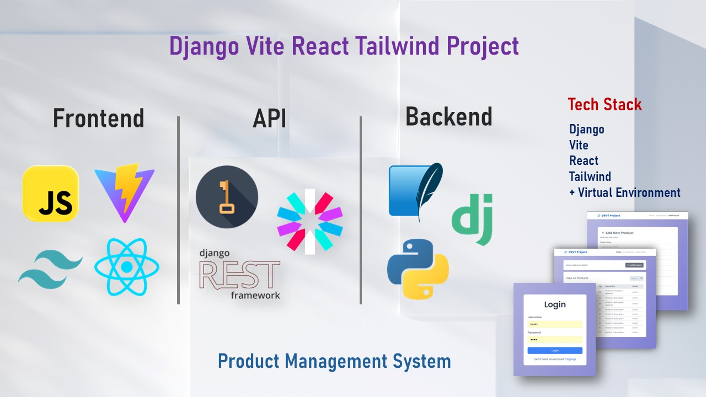
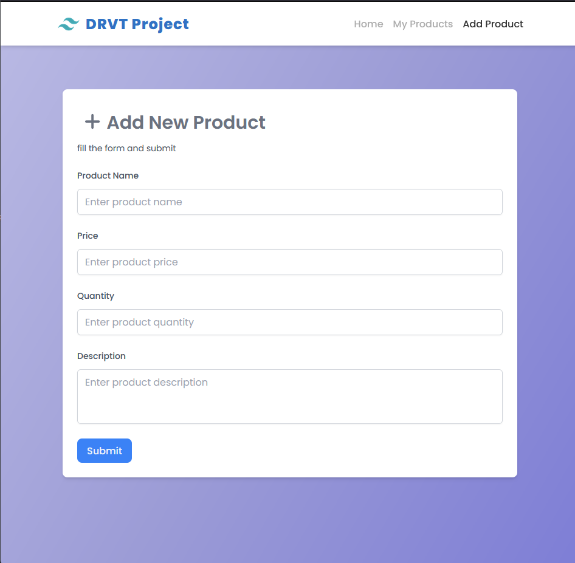
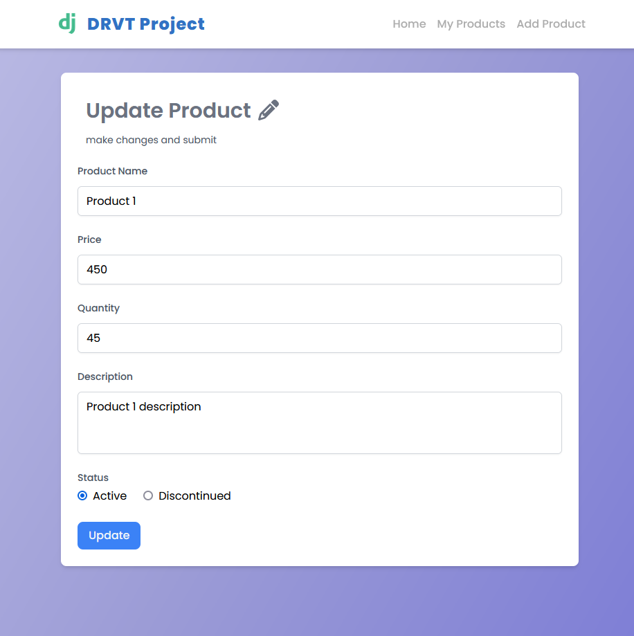

[](#)
[](#)


[](#)
[](#)


[](#)


# 🚀✨ Django Vite React Tailwind Project ✨🚀

A **full-stack web application** for managing products with 🔐 **User Authentication** and **Authorization**. ✨ Built with **Django | Django REST Framework** for the backend and **Vite | React | Tailwind CSS** for the frontend. ⚡ **fully Optimized Code** with **Fully Responsive Desing** for all devices! 🖥️📱



## 🌟 Features

### User Authentication

- 👤 **Register**: Create a new user account.
- 🔑 **Login**: Authenticate and access the system.
- 🚪 **Logout**: Securely log out of the system.

### Product Management

- ➕ **Add Product**: Add a new product to the system.
- 🗑️ **Delete Product**: Remove a product from the system.
- ✏️ **Edit Product**: Update product details (only the author can edit).
- 👀 **View Products**: Browse all products in the system.
- 🔎 **Search Products**: Search products by name, id, description.

### Authorization

- 🔒 Only the author of a product can edit or delete it.
- 🔓 All users can view the product list

## 🛠️ Tech Stack

### 🔙 Backend

- 🐍 **Python:** Programming language.
- 🎯 **Django:** Web framework.
- 🔄 **Django REST Framework (DRF):** For building RESTful APIs.
- 🔐 **Simple JWT**: For JSON Web Token authentication.
- 💾 **SQLite** (Default): Lightweight disk-based database (easily swappable).

### 🔝 Frontend

- ⚡ **Vite:** Fast build tool for React.
- ⚛️ **React:** JavaScript library for building user interfaces.
- 🎨 **Tailwind CSS:** Utility-first CSS framework for styling.
- 🔄 **Axios:** For making HTTP requests to the backend.
- 📦 **Node.js/npm:** JavaScript runtime and package manager.

## 🚀 Getting Started

### 📋 Prerequisites

- 🐍 Python 3.x installed.
- 📦 Node.js and npm (or yarn) installed.
- 💾 Database Setup:
  - The project uses SQLite by default (no extra setup needed).
  - If using PostgreSQL: Ensure PostgreSQL is installed and running. You might also need C++ build tools installed on your system (build-essential on Debian/Ubuntu, Build Tools for Visual Studio on Windows) for the psycopg2 package.

## ⚙️ Backend Setup

1. Clone the repository:

```bash
git clone https://github.com/kevinThulnith/django-vite-react-tailwind-project.git
```

2. Create a virtual environment:

```bash
python -m venv venv
source venv/bin/activate  # On Windows: .\venv\Scripts\activate
```

3. Install dependencies:

- install postgressSQL and c++ buid tool first.

```bash
pip install -r requirements.txt
```

4. Run migrations:

```bash
python manage.py migrate
```

5. Start the Django development server:

```bash
python manage.py runserver
```

6. Access the backend API at:

```bash
http://localhost:8000/
```

## ⚙️ Frontend Setup

1. Navigate to the frontend directory:

```bash
cd ../frontend
```

create .env in ./frontend and add VITE_API_URL="Django backend url"

2. Install dependencies:

```bash
npm install
```

3. Configure API Base URL:
   - Create a .env file in the frontend directory if it doesn't exist, and set the backend API URL:

```sh
VITE_API_BASE_URL=http://localhost:8000
```

4. Start the Vite development server:

```bash
npm run dev
```

5. Access the frontend at:

```bash
http://localhost:5173/
```

## 🌐 Hosting on Local Network

To access the application from other devices on your local network:

1. Get device **Ip** address

   - Windows: ipconfig (Look for "IPv4 Address" under your active network adapter)
   - macOS: ipconfig getifaddr en0 (or en1 for Wi-Fi)
   - Linux: ip addr show (Look for inet under your active network interface)

2. Start bachend

```bash
py .\manage.py runserver <Device Ip address>:8000
```

3. Start frontend

   - change **.env** file fist

```bash
npx vite --host {Device Ip Address}
```

## 📂 Project Structure

### Backend

```bash
backend/
├── manage.py
├── products/
│   ├── models.py          # Product model
│   ├── serializers.py     # Product serializer
│   ├── views.py           # Product views
│   └── urls.py            # Product URLs
├── users/
│   ├── models.py          # User model
│   ├── serializers.py     # User serializer
│   ├── views.py           # User views
│   └── urls.py            # User URLs
└── settings.py            # Django settings
```

### Frontend

```bash
frontend/
├── src/
│   ├── components/        # Reusable components
│   ├── pages/             # Pages (Login, Register, Product List, etc.)
│   ├── api/               # Axios API calls
│   ├── App.jsx            # Main application component
│   └── main.jsx           # Entry point
├── public/                # Static assets
└── tailwind.config.js     # Tailwind CSS configuration
```

## 🔐 Authentication Flow

- **Register:** A new user provides credentials (e.g., username, email, password) via the frontend form.
- **API Call:** Frontend sends a POST request to `/api/user/register/`.
- **Backend:** Creates the new user in the database.
- **Login:** User provides login credentials.
- **API Call:** Frontend sends a POST request to `/api/token/` (Simple JWT endpoint).
- **Backend:** Verifies credentials, generates access and refresh JWT tokens, and returns them.
- **Frontend:** Stores the tokens (e.g., in local storage or memory) and uses the `access` token in the Authorization: `Bearer <token>` header for subsequent protected requests.

- **Protected Routes:** Frontend routes/components check for a valid token before rendering. API requests to protected endpoints are validated by the backend using the token.

- **Logout:** User clicks logout.

- **API Call:** Frontend sends a POST request to `/api/token/blacklist/` with the refresh token (optional but good practice).

- **Frontend:** Removes tokens from storage, redirecting the user (e.g., to the login page).

## 🛒 Product Management Flow

- **Edit Product:** Only the author of a product can edit its details.
- **Delete Product:** Only the author of a product can delete it.
- **Add Product:** Authenticated users can add a new product.
- **View Products:** All users can view the list of products.
- **Search products:** All users can search the list of products.

## 🧪 Testing

### Backend

- Run the Django test suite:

```bash
python manage.py test
```

### Frontend

- Run the React tests:

```bash
npm test
```

## 📝 API Endpoints

### Users

- `POST /api/user/register/` - Register a new user.
- `POST /api/token/` - Log in and get an authentication token.
- `POST /api/token/blacklist/` - Log out and invalidate the token.

### Products

- `GET /api/products/all/` - Get a list of all products.
- `POST /api/products/` - Add a new product (authenticated users only).
- `GET /api/products/<id>/` - Get details of a specific product.
- `PUT /api/products/update/<id>/` - Update a product (author only).
- `DELETE /api/products/delete/<id>/` - Delete a product (author only).

## 📸 Screenshots

### Login Page


### Product List


### Add Product



### Update Product



## 🤝 Contributing

Contributions are welcome! Please follow these steps:

- Fork the repository.
- Create a new branch (git checkout -b feature/YourFeature).
- Commit your changes (git commit -m 'Add some feature').
- Push to the branch (git push origin feature/YourFeature).
- Open a pull request.

## 📜 License

This project is licensed under the MIT License. See the LICENSE file for details.
🙏 Acknowledgments

- Django REST Framework for the powerful backend.
- Vite and React for the blazing-fast frontend.
- Tailwind CSS for the beautiful and responsive design.
